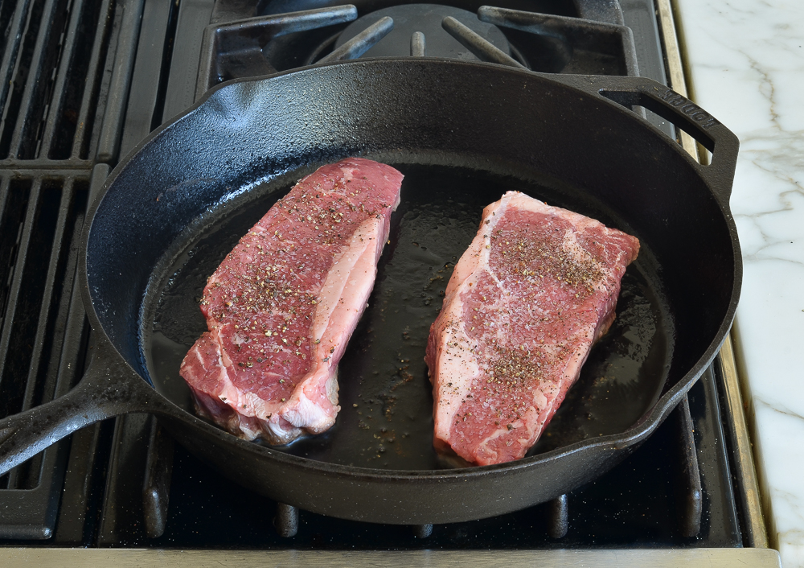

 # How to Cook a Steak 

Steak is a popular food choice becuase it is very high in protein, rich in iron, packed with vitamins, a source of healthy fats, while also being very delicious when cooked the right way. 

### WARNING: Hot Surfaces and Fire Hazards may cause harm to the user 

## Required Materials

- Steak
  
   > Choose a good cut like ribeye, sirloin, or filet mignon. 

- Salt & Pepper 

- Oil

   > Use a high smoke point oil like canola or vegetable oil.

- Tongs 

- Meat Thermometer 

- Cast Iron Skillet or Grill

- Aluminum Foil

- Cutting board or plate to place steak on

- Optional Ingredients 

   > Butter 
   > Garlic 
   > Fresh Herbs

## Steps

1. Preparation 

   - Let the steak sit at room temperature for about 30-60 minutes before cooking. This helps it cook more evenly.

   - Generously season both sides of the steak with salt and pepper.

      > 

2. Heating the Pan or Grill 

   - If using a cast iron skillet, heat it over medium-high heat for about 5 minutes until it's very hot. If using a grill, preheat it to high heat.

   - Once the pan or grill is hot, add a little oil to the skillet or brush it on the grill grates.

3. Cooking the Steak 

   - Place the steak in the hot pan or on the grill. You should hear a sizzle immediately.
      > 

   - Sear the steak for about 2-3 minutes on each side for a medium-rare steak. Do not move the steak around; let it develop a nice crust.
      > 

   - Use a meat thermometer to check the internal temperature.

       > Rare: 125 Degrees F 
       > Medium-Rare: 135 Degrees F
       > Medium: 145 Degrees F
       > Medium-Well: 150 Degrees F
       > Well-Done: 160 Degrees F 

4. Basting (Optional)

   - If you want extra flavor, add a tablespoon of butter, a smashed garlic clove, and a sprig of herbs to the pan.
      > 

   - Tilt the pan slightly and use a spoon to continuously baste the steak with the melted butter and juices for the last minute of cooking.

5. Resting the Steak

   -  Once the steak reaches your desired doneness, remove it from the pan or grill.

   -  Place the steak on a cutting board and cover it loosely with aluminum foil. Let it rest for about 5-10 minutes. This allows the juices to redistribute, making the steak juicier.
      > 

6. Serving 

   - Slice the steak against the grain for maximum tenderness and serve with your favorite sides.
   > 
